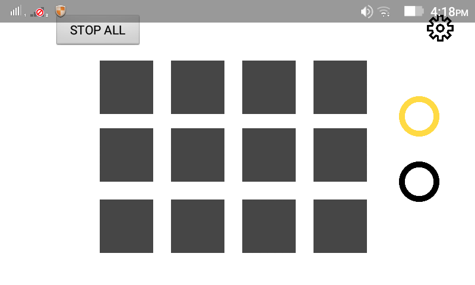
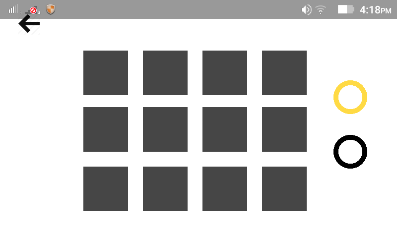
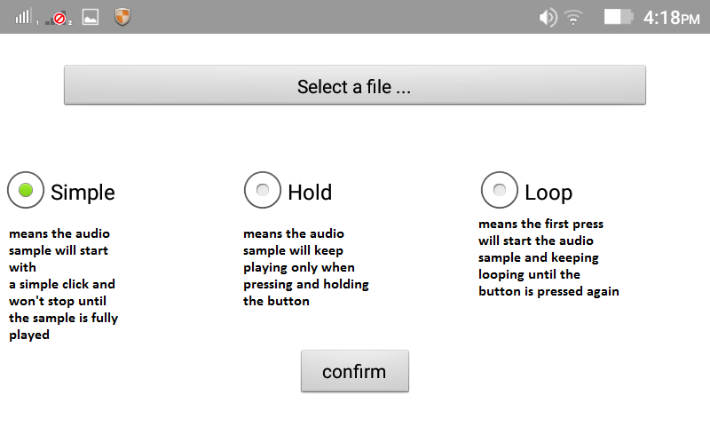
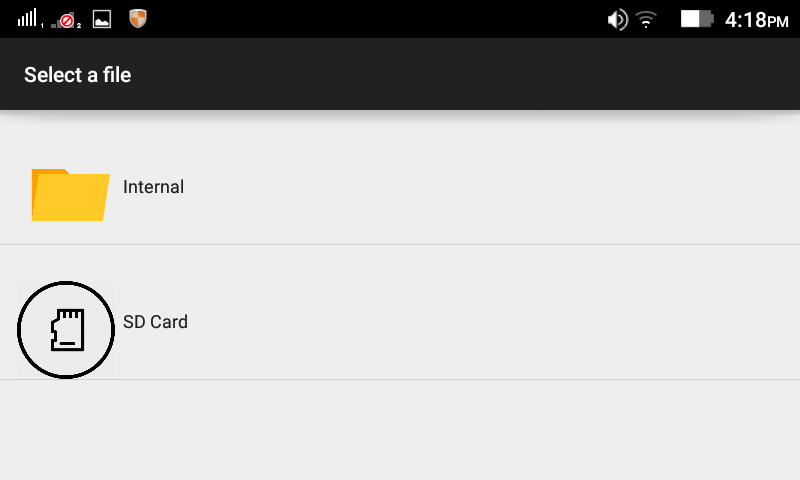

# LaunchPad

LaunchPad android App that simulate the real LaunchPad experience (still under development)

main BUGs: 
1/after changing a button config(CONFIGMODE),when pressing the same button in player mode(PLAYERMODE), 
the sound the start playing but on a second presse the sound won't stop whatever the selected mode is(Simple, Hold or Loop)
2/the app will crash after changing a same button config twice.

