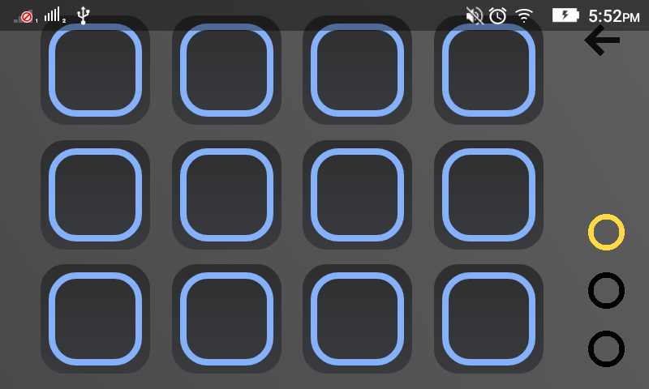

# LaunchPad Android app

##Description

This is on open source project made to simulate most(not all) of the real Launchpad experience.
This project is an educationnal project to learn android application developement using both of the SDK and the NDK.

##Licence

Permission is hereby granted, free of charge, to any person obtaining a copy
of this software to deal in the Software without restriction, including without 
limitation the rights to use, copy, modify, merge, publish, distribute, sublicense,
and/or sell copies of the Software.

##ScreenShots

